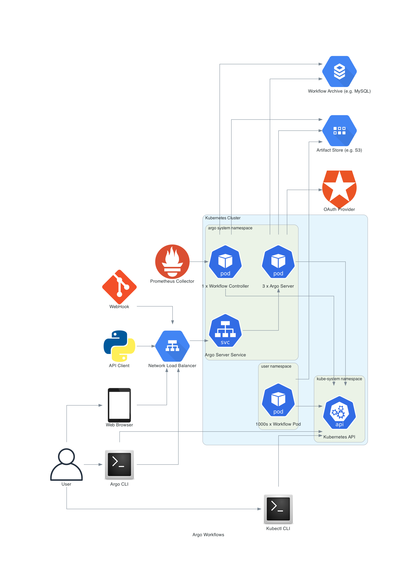
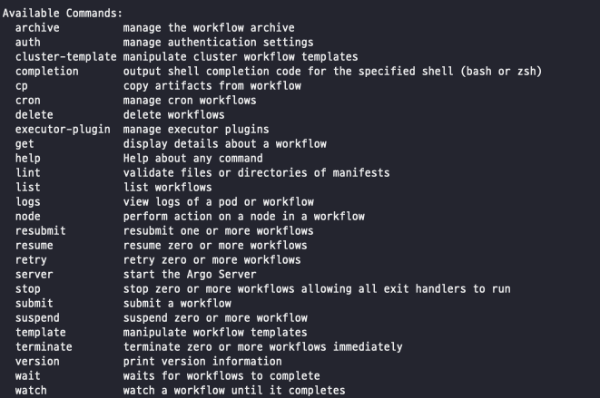
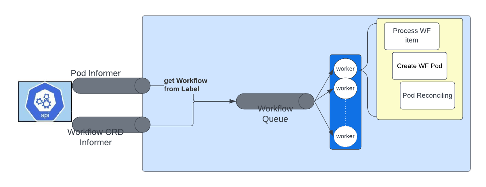
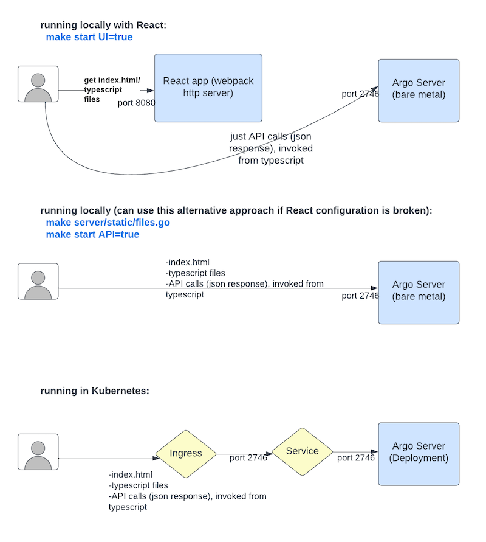

[Argo Workflow Documentation](https://argoproj.github.io/argo-workflows/architecture/) 에 있는 전체 다이어그램을 보고 어떻게 동작하는지 흐름을 분석해보자.  
그래도 한 두번 PR 을 올렸으므로 이제 전체 구조를 어느 정도 파악해볼 수 있다고 생각한다.

# Argo Workflow 다이어그램

# 구성 요소 분석
## CLI
### `kubectl CLI` 를 통해 k8s API 로 접근할 수 있다. 
이것은 k3d 로 argo 를 실행시켰을 때 평범한 k8s API 로 pod, config 등을 찾을 수 있다는 내용과 일치한다. (편리하다)  
### 별도의 `Argo CLI` 가 위치한다.
`make cli` 로 생성했을 시 dist 에 생성되는 argo 전용 명령셋이다.

k8s CLI 와 동일하게 k8s API 를 향하기도 하지만, `Network Load Balancer` 로 화살표가 가는 것이 보인다. 

k8s CLI 는 할 수 없고 argo CLI 만 할 수 있는 작업이 뭘까?

`argo --help` 으로 가능한 명령 목록을 살펴보았을 때, `argo server` 와 같은 명령인 것 같다.

화살표의 방향으로 판단하면 Argo Server 로 접근 가능한 것은 Argo CLI 밖에 없기 때문.

> 이 부분은 `cmd/argo/commands` 이하 커맨드를 조사하면 확실히 알 수 있을 것 같긴 하다.

## Workflow

아마 가장 중요한 부분이라고 생각된다.

공식 문서에도 쓰여 있지만 argo workflow 는 `argo` 네임스페이스에 위치한 `workflow controller` 나 `argo UI` 와는 별개의 유저 네임스페이스에 위치한다.

크게 `step` pod 와 `DAG` pod 로 workflow 종류가 나뉘는데, step 은 기본적인 작업을 수행하는데 유리하고, DAG 는 말 그대로 유향 비순환 그래프 형상을 띄는 복잡한 의존도를 가진 작업에 적합하다.

Overview 자료에 따르면 각 pod 는 세 개의 컨테이너로 구성되어 있고 각각의 역할이 존재한다.

### Main 컨테이너
유저가 지정한 작업을 수행하는 컨테이너. [argoexec](https://github.com/argoproj/argo-workflows/tree/master/cmd/argoexec) 이 일종의 헬퍼 컴포넌트로, [사이드카](https://learn.microsoft.com/en-us/azure/architecture/patterns/sidecar) 로 붙는다.  
아직 이 사이드카 관련 코드를 깊게 확인하지 못했지만, 하는 역할을 살펴보면.

* Artifact 핸들링 : 유저 코드의 입출력부터 여러 플랫폼 (S3, Git, Artifactory) 저장 역할까지 수행한다.
* 로깅 : 각 스텝을 캡쳐하여 로깅한다.
* 스크립트 실행 : 유저가 지정한 스크립트를 실제 수행하는 역할.
* 작업 수행 대기 및 최종 상태 방출 : 지정한 작업이 최종적으로 끝나고 success 또는 fail 로 완료 상태를 내보낼 수 있다.
* 리소스 관리 : 스텝이 완료된 후 리소스를 정리할 수 있다.

... 일단은 대충 실제 작업에 필요한 중요한 역할은 다 한다고 생각하면 될 것 같다.

### Init 컨테이너
Artifact 를 패칭하고 Main 컨테이너에서 사용할 수 있도록 만든다.

> Artifact 란? 
>  
> 소프트웨어 공학 측면에서 볼 때, 개발 프로세스에서 만들어지는 모든 것들이 Artifact 가 될 수 있다.  
> 컴파일된 소스, WAR 파일, Docker 이미지, 문서, 테스트 결과 등.  
> CI/CD 파이프라인에서는 프로세스에 필수적인 조각을 Artifact 라고 정의하는 것 같다.  
> 즉, 여기서는 각 스텝에서 사용되거나 생성되는 컴파일된 코드나 Docker 이미지 따위가 Artifact 된다.

### Wait 컨테이너
작업이 끝난 후 Clean Up 을 수행한다. 파라미터나 Artifact 를 저장하는 작업 또한 수행된다.

## Workflow Controller

아직까지 좀 이해하기 어려운 부분 중 하나다.  
여러 검색을 통해서 알 수 있는 것은 내가 아직 Kubernetes 자체에 대해 잘 모르기 때문이라는 결론이다.  
이 다이어그램의 대부분은 그냥 Kubernetes 관련 내용이다.  
몇 가지 기본적인 사항은 아래와 같다.

### Reconciliation
[Kubernetes Reconciliation](https://speakerdeck.com/thockin/kubernetes-what-is-reconciliation)

K8S 의 핵심 컨셉 중 하나로 어떤 리소스(여기서는 workflow) 를 Submit 했을 시 사용자가 원하는 이 리소스의 최종 상태가 있을 것이다.  
그렇다면 컨트롤러는 이 `원하는 상태` 를 만들기 위한 프로세스를 시작하는데, 이것을 Reconciliation 이라고 한다.  
여기에는 서로 다른 유저에 의한 리소스 생성이나, 삭제 등도 포함된다.  
유효한 최종 상태에 도달하기 위해서 지속적으로 컨트롤러가 일종의 메타데이터를 감시하고 수행하는 작업이다.
> 기존에 좀 당연하게 썼던 deploy 나 namespace 가 다 이런 컨셉에 연관되어 있는 내용이었다.

### Informer
Kubernetes 에서 Reconciliation 을 수행하기 위한 패턴.  
k8s 의 상태를 메모리에 저장하고, 변경된 상태를 감시한다. (당연할 수도 있지만... Observer 패턴이라고 한다)  
Argo Workflow 에서는 Workflow 와 Workflow 를 구성하는 Pod 들이 대상이 된다.  
> 그리고 Workflow 가 생성되거나, 업데이트되거나, Workflow 내 Pod 가 업데이트된다면, 해당 Workflow 를 Workflow Queue 에 추가한다.
각 Worker 는 Reconciliation 에 따라 원하는 상태를 맞추기 위해 작업을 수행한다.

### 각 Worker 는 goroutine 이고, Workerflow Queue 에 쌓인다.
왜 동시성을 제공하는 goroutine 이면서 Queue 에 포함되나? 라고 생각하면 순서가 필요한 작업과 병렬성이 필요한 작업이 혼재하기 때문이라고 생각한다.  
Workflow 는 순서가 있기도 하지만 동시에 수행되는 작업도 존재하기 때문이다.  
그런 측면에서 Queue + Goroutine 은 매우 현명한 설계라고 생각된다.

### CRD (Custom Resource Definitions)
Argo Workflow 에서는 Pod 뿐만 아니라 새롭게 정의한 Workflow 리소스 타입에 대한 Informer 를 생성한다.  
공식 문서에는 [controller.go](https://github.com/argoproj/argo-workflows/blob/master/workflow/controller/controller.go) 에서 확인하라고 하는데... 추후 이쪽으로 컨트리뷰트 할 일이 있다면 좀 살펴봐야 할 것 같다.

# Argo Server / UI

Argo 는 Controller 이외에도 Server 가 따로 있다는 것이 좀 특이한 것 같다.
첫 번째로 올렸던 전체 다이어그램으로 판단한다면,

* 프론트엔드 연동을 위한 API 연동
* Oauth 연동
* Artifact Store 연동 (S3 등)
* Workflow 아카이브 연동

등 대체적으로 외부 서비스 연동에 특화되어 있다고 생각한다.  
Controller 만으로 핵심 기능은 다 있겠지만 UI 도 필요하고, 로그인도 필요하고, Workflow 작업 저장도 해야되고... 사용자를 위한 서버가 어쨌든 필요하니까.

위 도표 자체는 그냥 React 로도 쓸 수 있고, 서버 사이드를 통한 프론트엔드도 제공한다는 의미로 보인다.  
핫 리로딩을 제공하고, 타입스크립트로 짜여 있는데... 관련 PR 도 하긴 했지만 React 코드는 만지기가 좀 겁난다.

# 결론

Kubernetes... 열심히 공부 해야겠지?