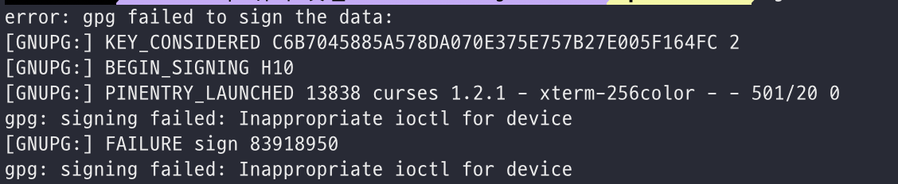

gpg 를 이용한 git signoff 커밋 중 다음과 같은 상황을 만날 수 있다.



Mac 에서 터미널에 아래와 같은 커맨드 실행

```
export GPG_TTY=$(tty)
```

Mac/Linux 에서는 TTY(Teletypewriter) 을 사용하는데, 터미널 환경에서 GPG 에게 TTY 를 명시적으로 알려주어야 한다. (Sign 작업을 수행할 수 있도록.)