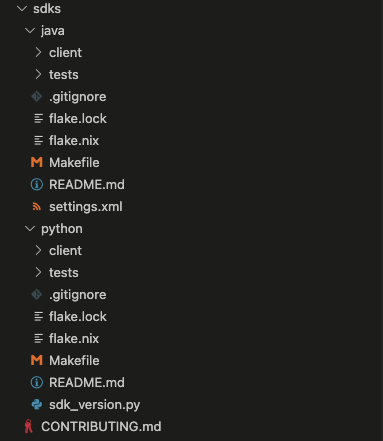

`make codegen` 가 정확히 뭘 하는지 궁금해서 조사해본 내용.   
argo workflow 에 Makefile 에서 찾아보면 codegen 은 다음과 같이 구성되어 있다.

```make
.PHONY: codegen
codegen: types swagger manifests $(GOPATH)/bin/mockery docs/fields.md docs/cli/argo.md
go generate ./...
make --directory sdks/java generate
make --directory sdks/python generate
```

뭘 make 하는 명령인지 하나씩 찾아보자.


# 실행

`make codegen` 으로 make 명령 실행.  
별도의 devcontainer 와 같은 환경이 필요하지 않다.  
그냥 Makefile 과 동일한 위치에서 해당 커맨드를 실행하는 것만으로 정상 동작해야 한다.


# Makefile 타겟 종류

추후 Makefile 에 대해 더 깊게 조사하기로 하고, 여기서는 간단하게 Make 의 타겟 종류에 대해 서술한다.  
* 참고 : ['what is a make target?'](https://stackoverflow.com/questions/2270643/what-is-a-make-target)


## Phony Target

아래와 같은 스타일의 타겟이다.

```make
.PHONY: controller
controller: dist/workflow-controller
```

Phony(가짜, 허위의) 타겟은 이 타겟이 실제 파일과 연관된 것이 아니라는 것을 의미한다.  
실제 파일이 빌드 되는 것이 아닌 몇 가지 명령 묶음의 실행이 필요하다면 유용하다.

## File Target

```make
$(GOPATH)/bin/mockery: 
	go install github.com/vektra/mockery/v2@v2.10.0
```

위 내용을 예로 들면, `$(GOPATH)/bin/mockery` 이 `go install github.com/vektra/mockery/v2@v2.10.0` 명령을 통해서 빌드되거나 업데이트 된다는 것을 의미한다.

어디선가 `$(GOPATH)/bin/mockery`  를 실행할 때, `make` 는 즉시 `$(GOPATH)/bin/mockery`  이 존재하는지 확인한다.  

만약 이 파일이 없거나 이 파일의 의존성이 지금 파일의 상태보다 더 최근에 업데이트 되었다면, 다시 연관된 명령 `go install github.com/vektra/mockery/v2@v2.10.0` 을 실행한다.

# 의존성 타겟

다시 돌아와서 `codegen` 이 하는 일을 살펴보자.  

먼저, 아래 target 에 대한 의존성을 검사한다.  

즉, `codegen: ` 이후에 있는 의존성 목록을 확인하면...


* `types`  가 실행 되었는지?
* `swagger` 가 실행 되었는지?
* `manifests` 가 실행 되었는지?
* `$(GOPATH)/bin/mockery` 가 실행/업데이트 되었는지?
* `docs/fields.md` 가 실행/업데이트 되었는지?
* `docs/cli/argo.md` 가 실행/업데이트 되었는지?


를 진행한다. 하나씩 어떤 의존성인지 파악해보자.

## 1 단계 : types

Makefile 에 존재하는 아래 커맨드를 의미한다.  

```make
.PHONY: types
types: check-pwd pkg/apis/workflow/v1alpha1/generated.proto pkg/apis/workflow/v1alpha1/openapi_generated.go pkg/apis/workflow/v1alpha1/zz_generated.deepcopy.go
```

### 의존성 리스트
* check-pwd
* pkg/apis/workflow/v1alpha1/generated.proto
* pkg/apis/workflow/v1alpha1/openapi_generated.go 
* pkg/apis/workflow/v1alpha1/zz_generated.deepcopy.go

`types` 가 Phony 타겟이고 의존성만으로 이루어진 명령이다.  
각 의존성 타겟과 연관된 작업을 수행하는데, 각 타겟의 내용을 간단하게 적어보면... (의존성이 끝도 없다)

<br/>

* **check-pwd**
	* 현재 경로(pwd)가 SRC 인지 확인하는데, 아니면 경고를 출력한다.
	* SRC 는 `$(GOPATH)/src/github.com/argoproj/argo-workflows` 로 설정되어 있다.
	* 즉, 이 명령이 실행되는 위치가 위와 같은 위치로 고정되어야 한다는 것을 의미한다.
	* codegen 실행 시 위에 경로가 아니면 항상 경고가 뜨는 이유.
	* 왜? 에 대해서는 codegen 제약 사항과 연관이 있어보이는데, 예전에 codegen 빌드 실패 시 발견한 로그(protoc)와 연관이 있어 보인다.
		>  /home/vscode/go/src/github.com/argoproj/argo-workflows/vendor/k8s.io/apimachinery/pkg/util/intstr/generated.proto: File does not reside within any path specified using --proto_path (or -I).  You must specify a --proto_path which encompasses this file.  Note that the proto_path must be an exact prefix of the .proto file names -- protoc is too dumb to figure out when two paths (e.g. absolute and relative) are equivalent (it's harder than you think).

<br/>

* **pkg/apis/workflow/v1alpha1/generated.proto**

```make
pkg/apis/workflow/v1alpha1/generated.proto: $(GOPATH)/bin/go-to-protobuf $(PROTO_BINARIES) $(TYPES) $(GOPATH)/src/github.com/gogo/protobuf

# These files are generated on a v3/ folder by the tool. Link them to the root folder
[ -e ./v3 ] || ln -s . v3
# Format proto files. Formatting changes generated code, so we do it here, rather that at lint time.
# Why clang-format? Google uses it.

find pkg/apiclient -name '*.proto'|xargs clang-format -i
$(GOPATH)/bin/go-to-protobuf \
--go-header-file=./hack/custom-boilerplate.go.txt \
--packages=github.com/argoproj/argo-workflows/v3/pkg/apis/workflow/v1alpha1 \
--apimachinery-packages=+k8s.io/apimachinery/pkg/util/intstr,+k8s.io/apimachinery/pkg/api/resource,k8s.io/apimachinery/pkg/runtime/schema,+k8s.io/apimachinery/pkg/runtime,k8s.io/apimachinery/pkg/apis/meta/v1,k8s.io/api/core/v1,k8s.io/api/policy/v1 \
--proto-import $(GOPATH)/src

# Delete the link
[ -e ./v3 ] && rm -rf v3
touch pkg/apis/workflow/v1alpha1/generated.proto
```

... 대충 확인해봐도 grpc 및 proto generate 와 관련된 명령이라는 것을 확인할 수 있다.  
argo workflow 의 grpc 는 이 단계에서 빌드된다.  

<br/>

* **pkg/apis/workflow/v1alpha1/openapi_generated.go**

```make
pkg/apis/workflow/v1alpha1/openapi_generated.go: $(GOPATH)/bin/openapi-gen $(TYPES)

# These files are generated on a v3/ folder by the tool. Link them to the root folder
[ -e ./v3 ] || ln -s . v3
$(GOPATH)/bin/openapi-gen \
--go-header-file ./hack/custom-boilerplate.go.txt \
--input-dirs github.com/argoproj/argo-workflows/v3/pkg/apis/workflow/v1alpha1 \
--output-package github.com/argoproj/argo-workflows/v3/pkg/apis/workflow/v1alpha1 \
--report-filename pkg/apis/api-rules/violation_exceptions.list

# Delete the link
[ -e ./v3 ] && rm -rf v3
```

OpenAPI 스펙을 생성하기 위한 커맨드로 보인다.  
조사해봐야 알겠지만 (아마도) API 문서를 위한 생성 과정이 아닌가 싶다.

<br/>

* **pkg/apis/workflow/v1alpha1/zz_generated.deepcopy.go**

```make
# generates many other files (listers, informers, client etc).
pkg/apis/workflow/v1alpha1/zz_generated.deepcopy.go: $(TYPES)

# These files are generated on a v3/ folder by the tool. Link them to the root folder
[ -e ./v3 ] || ln -s . v3
bash $(GOPATH)/pkg/mod/k8s.io/code-generator@v0.21.5/generate-groups.sh \
"deepcopy,client,informer,lister" \
github.com/argoproj/argo-workflows/v3/pkg/client github.com/argoproj/argo-workflows/v3/pkg/apis \
workflow:v1alpha1 \
--go-header-file ./hack/custom-boilerplate.go.txt

# Delete the link
[ -e ./v3 ] && rm -rf v3
```

kubernetes 의 `code-generator` 패키지의 스크립트를 실행한다.

* deepcopy
* client
* informer
* lister

 ... 역시나 (k8s 를 공부를 안했기에) 잘 모르는 부분이다.  
 대충 검색한 내용을 종합하자면 이 스크립트들은 각각 아래 내용을 생성한다고 한다.

* 커스텀 리소스 오브젝트를 deep copy 하기 위한 function 생성
* 커스텀 리소스를 위한 typed client 클라이언트 세트
* 리소스에 대해 (create, update, delete 와 같은) 이벤트 수신을 가능하게 만드는 Informer
* 커스텀 리소스의 상단에 read-only 캐시층을 제공하는 lister

아마도... 커스텀 리소스인 Workflow 와 관련이 있을 수도 있을 것 같다.  
종합하자면, argo-workflow 의 v1alpha 에 포함되는 Workflow API 와 큰 연관성이 있다고 판단된다.


## 2 단계 : swagger

```make
.PHONY: swagger

swagger: \
pkg/apiclient/clusterworkflowtemplate/cluster-workflow-template.swagger.json \
pkg/apiclient/cronworkflow/cron-workflow.swagger.json \
pkg/apiclient/event/event.swagger.json \
pkg/apiclient/eventsource/eventsource.swagger.json \
pkg/apiclient/info/info.swagger.json \
pkg/apiclient/sensor/sensor.swagger.json \
pkg/apiclient/workflow/workflow.swagger.json \
pkg/apiclient/workflowarchive/workflow-archive.swagger.json \
pkg/apiclient/workflowtemplate/workflow-template.swagger.json \
manifests/base/crds/full/argoproj.io_workflows.yaml \
manifests \
api/openapi-spec/swagger.json \
api/jsonschema/schema.json
```

...그냥 봐도 swagger 를 생성할 것 같이 생긴 부분이다. (뭔가 재미 없어 보인다)  
하지만 두 가지가 좀 특이한데,

1. `manifests` 의 호출
2. 각 swagger.json 에서 아래와 같은 명령 실행
	> $(call protoc,pkg/apiclient/sensor/sensor.proto)
	
`manifests` 명령의 경우 뒤에서 설명하겠지만, 여러 의존성 패키지를 설치하는 과정으로 보인다.  
mysql 을 설치한다든지, kubernetes 환경을 세팅한다든지와 같은 내용이다.  
codegen 에서 실행되는 것은 당연해보이지만, swagger 명령에서도 의존성으로 걸려 있는 것은 좀 의외다.  
더 자세히 봐야 알겠지만, Swagger Doc 을 구성하기 위해 최신화된 manifests 설정을 요구한 것일 수도 있다.

그리고 2번 항목은 swagger.json 을 생성하기 위해 각 proto 파일을 참조한다는 것을 의미한다.  
`protoc` 는 또 Makefile 에 정의되어 있는 Task 인데... 간단히 말해 `protoc` 컴파일러를 이용하여 protobuf 를 컴파일하고 있다.  
그리고 이 과정에서 swagger 가 떨어지니, swagger 에서 이 Task 를 요구하는 것도 이상하진 않다.

대략적으로 확인했으니 다음으로 넘어가자.

## 3 단계 : manifests

swagger 에서도 봤던 커맨드다.  `codegen` 자체도 이 의존성을 가지고 있다.

```make
.PHONY: manifests
manifests: \
manifests/install.yaml \
manifests/namespace-install.yaml \
manifests/quick-start-minimal.yaml \
manifests/quick-start-mysql.yaml \
manifests/quick-start-postgres.yaml \
dist/manifests/install.yaml \
dist/manifests/namespace-install.yaml \
dist/manifests/quick-start-minimal.yaml \
dist/manifests/quick-start-mysql.yaml \
dist/manifests/quick-start-postgres.yaml
```

음... 잘 모르겠다.  
일단 바로 아래에 이 의존성들과 관련된 Target 들이 나오는데.

```make
.PHONY: manifests/install.yaml
manifests/install.yaml: /dev/null
kubectl kustomize --load-restrictor=LoadRestrictionsNone manifests/cluster-install | ./hack/auto-gen-msg.sh > manifests/install.yaml


.PHONY: manifests/namespace-install.yaml
manifests/namespace-install.yaml: /dev/null
kubectl kustomize --load-restrictor=LoadRestrictionsNone manifests/namespace-install | ./hack/auto-gen-msg.sh > manifests/namespace-install.yaml


.PHONY: manifests/quick-start-minimal.yaml
manifests/quick-start-minimal.yaml: /dev/null
kubectl kustomize --load-restrictor=LoadRestrictionsNone manifests/quick-start/minimal | ./hack/auto-gen-msg.sh > manifests/quick-start-minimal.yaml


.PHONY: manifests/quick-start-mysql.yaml
manifests/quick-start-mysql.yaml: /dev/null
kubectl kustomize --load-restrictor=LoadRestrictionsNone manifests/quick-start/mysql | ./hack/auto-gen-msg.sh > manifests/quick-start-mysql.yaml


.PHONY: manifests/quick-start-postgres.yaml
manifests/quick-start-postgres.yaml: /dev/null
kubectl kustomize --load-restrictor=LoadRestrictionsNone manifests/quick-start/postgres | ./hack/auto-gen-msg.sh > manifests/quick-start-postgres.yaml


dist/manifests/%: manifests/%
@mkdir -p dist/manifests
sed 's/:latest/:$(VERSION)/' manifests/$* > $@
```

`kubectl kustomize` 라는 kubectl 커맨드를 수행한다.

### kustomize
`kubectl` 은 익숙한데 `kustomize` 는 음.... 모르겠다. 진짜 모르겠다. (모르는게 너무 많다)  
찾아보니 [kustomize](https://kustomize.io/) 라는 것을 통해 Yaml 을 템플릿화 할 수 있는 툴로 보인다.  
다행히 사이트에서 TL;DR 을 적어놓았는데...

```text
TL;DR
- Kustomize helps customizing config files in a template free way.
- Kustomize provides a number of handy methods like generators to make customization easier.
- Kustomize uses patches to introduce environment specific changes on an already existing standard config file without disturbing it.
```

쿠버네티스에서 사용되는 yaml 파일들을 템플릿처럼 사용하여 조합하는 일종의 generator 로 판단된다.  
(그리고 계층 구조를 만들어서 각 배포 단계에 따라 구분하여 빌드할 수도 있다)  
다행히 docs 페이지가 잘 만들어졌는데... [공식 documentation](https://kubectl.docs.kubernetes.io/guides/introduction/kustomize/) 에서 좀 더 자세한 내용을 알 수 있다.

되돌아오면, manifests 는 kustomize 로 뭘 수행하는가? 하는 의문점이 남는다.  
예를 들어 하나의 명령만 살펴보면.

```
kubectl kustomize --load-restrictor=LoadRestrictionsNone manifests/quick-start/postgres | ./hack/auto-gen-msg.sh > manifests/quick-start-postgres.yaml
```

이런 형태인데, 빌드의 소스가 되는 것은 `manifests/quick-start/postgres` 일 것이다.  
이것은 디렉토리 위치를 나타내는데 manifests/quick-start/postgres 아래에는 kustomization.yaml 이라는 파일이 존재하고 여러 연관된 파일이 같이 위치한다.  
(아마 kustomize 가 동작하는 방식과 연관이 있을 것이다)  
이 파일들이 `kubectl kustomize` 를 통해 커스텀된 kubernetes yaml 파일 같은게 생성되지 않을까 싶다.  

그리고 파이프라인을 통해 넘어가는 다음 명령은 `./hack/auto-gen-msg.sh` 파일의 실행으로, 이 쉘스크립트는 단순하다.

```shell
#!/usr/bin/env bash
set -eu -o pipefail

echo "# This is an auto-generated file. DO NOT EDIT"
cat
```

스크립트 오류 방지용 set 행을 제외하면 단순 echo 프린트와 마지막 `cat` 으로 EOF 를 기다리는 스크립트로 보인다.  
결국은 최종적으로 `manifests/quick-start-postgres.yaml` 으로 쓰여진다는 건데, 결국 `kustomize` 를 통해서  `manifests/quick-start-postgres.yaml` 를 만든다 정도로 판단하면 되겠다.  

> 이 manifests 아래에 생성된 yaml 들이 언제 어떻게 쓰이는지도 꽤 중요할 것 같은데...  
> 이것은 가장 마지막에 dist/manifests/% 에서 확인할 수 있다.


### dist/manifests/%

먼저 sed 커맨드를 통해서 latest 로 되어 있는 내용을 특정 버전으로 변경해주고 (아마도 latest 버전 사용을 막기 위해서...?), `kustomize` 로 최종 생성되었던 yaml 파일들을 `dist/manifests` 폴더에 저장시킨다.  

결과적으로 `manifests` 커맨드 수행이 완료되면 dist/manifests 에 완성된 yaml 파일들이 쌓인다!


## 4 단계 : $(GOPATH)/bin/mockery

```make
$(GOPATH)/bin/mockery:
go install github.com/vektra/mockery/v2@v2.10.0
```

$GOPATH 아래에 `mockery` 툴이 인스톨되어 있는지 확인하고 없다면 인스톨한다.

[https://github.com/vektra/mockery](https://github.com/vektra/mockery)

Golang Interface 를 위한 mock 을 생성해주는 패키지라고 하는데 단위테스트에 쓰이는 Go 패키지인듯.

[https://zaccoding.tistory.com/43](https://zaccoding.tistory.com/43)

이 블로그에서 사용법을 확인할 수 있었는데 확실히 아래와 같은 형태의 생성된 코드를 argo workflow 에서 종종 본 것 같다.

```go
func (_m *MockUserDB) Save(ctx context.Context, u *User) error {
    ret := _m.Called(ctx, u)

    var r0 error
    if rf, ok := ret.Get(0).(func(context.Context, *User) error); ok {
        r0 = rf(ctx, u)
    } else {
        r0 = ret.Error(0)
    }

    return r0
}
```

## 5 단계 : docs/fields.md target

```make
docs/fields.md: api/openapi-spec/swagger.json $(shell find examples -type f) hack/docgen.go
env ARGO_SECURE=false ARGO_INSECURE_SKIP_VERIFY=false ARGO_SERVER= ARGO_INSTANCEID= go run ./hack docgen
```

타겟은 `docs/fields.md` 파일을 생성하거나 업데이트 시키는 것이다.  
해당 파일은 swagger.json 및 examples 폴더 아래 모든 파일, 그리고 docgen.go 라는 스크립트를 의존성으로 갖는다.   즉, 위 의존성 타겟들이 재생성된다면 `docs/fields.md` 도 업데이트 된다.  
이 파일을 생성하기 위해서는 `./hack docgen` 을 실행하는 것으로 보이는데. 결론적으로 docs/fields.md 파일은 아래와 같다.

```md
# Field Reference

## Workflow

Workflow is the definition of a workflow resource

<details>
<summary>Examples (click to open)</summary>
<br>


- [`archive-location.yaml`](https://github.com/argoproj/argo-workflows/blob/master/examples/archive-location.yaml)

  
- [`arguments-artifacts.yaml`](https://github.com/argoproj/argo-workflows/blob/master/examples/arguments-artifacts.yaml)


- [`arguments-parameters-from-configmap.yaml`](https://github.com/argoproj/argo-workflows/blob/master/examples/arguments-parameters-from-configmap.yaml)


- [`arguments-parameters.yaml`](https://github.com/argoproj/argo-workflows/blob/master/examples/arguments-parameters.yaml)


- [`artifact-disable-archive.yaml`](https://github.com/argoproj/argo-workflows/blob/master/examples/artifact-disable-archive.yaml)
```

`docgen.go` 파일을 확인해보니 주로 swagger 를 가지고 docs 를 위한 md 파일을 자동 생성하는 과정이라는 것을 알 수 있었다.

## 6 단계 : docs/cli/argo.md

```make
docs/cli/argo.md: $(CLI_PKGS) go.sum server/static/files.go hack/cli/main.go
go run ./hack/cli
```

`docs/cli/argo.md` 도 짐작 가능하다시피 결국 docs 를 위한 md 파일 자동 생성으로 판단된다.  
특이하게 `go.sum` 이나 `server/static/files.go`  에도 의존성이 붙어 있는데, 역시나 이런 타겟들이 변경될 때도 argo.md 가 생성 또는 업데이트 될 것이다.

이 md 파일을 생성하는 /hack/cli 의 main.go 는 엄청 간단한데,

```go
func main() {
	println("generating docs/cli")
	
	cmd := commands.NewCommand()
	
	cmd.DisableAutoGenTag = true
	
	err := doc.GenMarkdownTree(cmd, "docs/cli")
	
	if err != nil {
	
	panic(err)
	
	}
}
```

추적해보면 그냥 커맨드 라인 트리를 확인하고 그걸 그대로 argo.md 파일에 붙인다.  
말 그대로 어떤 CLI 가 있는지 알려주는 docs 를 위한 생성 부분.


# 명령 묶음

이제 의존성 타겟을 제외하고 `codegen` 이 수행하는 명령들을 볼 차례다.  

```make
go generate ./...
make --directory sdks/java generate
make --directory sdks/python generate
```

`go generate ./...` 는 현재 디렉토리와 서브디렉토리에 대해 [코드 생성](https://go.dev/blog/generate)을 실행한다.  
`//go:generate`  로 전체 파일을 검색했을 때, 주로 위에서 언급한 `mockery` 에 대한 코드 생성이 자주 등장했다.

이하 두 개의 별도 make 는 SDK 생성에 관한 Makefile 실행이다.  
argo workflow 내 sdk 디렉토리에는 아래 스크린샷처럼 java 와 python, 두 개의 sdk 가 존재하고, 각각이 별도의 Makefile 을 가지고 있다.



즉, codegen 시에는 이 sdk 도 빌드가 되고, 이 과정에서도 꽤 시간이 걸릴 수 있다는 의미다.  
(그래서 각 sdk 의 CONTRIBUTING.md 에는 `make it fase` 라고 상단에 강조되어 있다. 매번 쓰는 codegen 은 빌드가 빨라야 되니...)

이 sdk 는 각각 argo workflow 를 각각 java 와 python 형태의 [클라이언트 라이브러리](https://argoproj.github.io/argo-workflows/client-libraries/)로 쓸 수 있게 해준다.  
codegen 커맨드를 통해 각 sdk 가 makefile 을 통해 최신화 되니, 해당 언어를 쓰는 사용자도 매번 최신화된 sdk 를 통해 restful api 요청을 안심하고 쓸 수 있을 것이라고 생각해볼 수 있겠다.

# 정리

`make codegen` 이 하는 일은 처음 예상처럼 단순 문서 생성은 아닌 것으로 확인했다.

말 그대로 코드 생성과 관련된 잡다한 커맨드는 모두 포함되어 있는데, 최종적으로는 이런 코드 생성을 기반으로 문서 역시 생성하는 Make 명령이다.

따라서 역할만 정리하자면 아래와 같다.

* protoc 를 통한 proto buffer 컴파일 (grpc)
* 필요한 yaml 리소스 생성 (kustomize)
* 테스트를 위한 mock 생성
* 문서 자동 생성
* go generate
* sdk make

당연히 시간이 꽤 걸리는 작업이고... 걸릴 수 밖에 없는 작업인 것 같다.

참고로 커뮤니티에서 커밋 전에 권장하는 `make pre-commit -B` 와 같은 경우 아래와 같은데.

```make
.PHONY: pre-commit
pre-commit: codegen lint docs
# marker file, based on it's modification time, we know how long ago this target was run
touch dist/pre-commit
```

이 과정도 codegen 이 포함되고, lint 와 docs 가 추가로 들어간다.  
그래서 오래 걸리는 작업이고, argo workflow 의 디렉토리 위치가 codegen 요구사항과 다르다면 에러가 날 것이다.

하지만 종종 codegen (또는 pre-commit) 을 수행하지 않고 push 한 것인지 pull 을 새로 받고 codegen 을 실행했을 때 새롭게 코드나 문서로 들어오는 항목들을 볼 수 있다.  

Git Action 에서 자동으로 생성될 것도 같은데 항상 그런 것은 아닌 것 같기도...